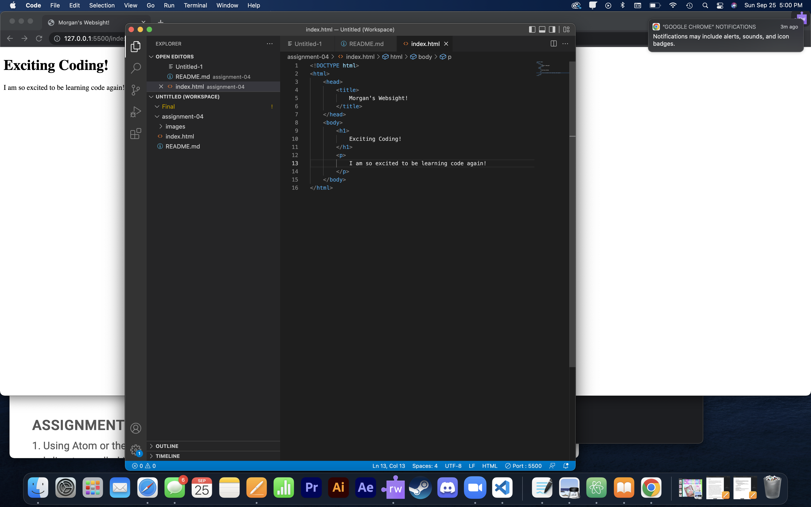

Browsers first sends a request to a server to recive the information need to sho the page that was requested through the user interface.
I mostly use Safari and a little bit of Chrome on my Mac, but if I'm on my HP i will use Chrome.
 