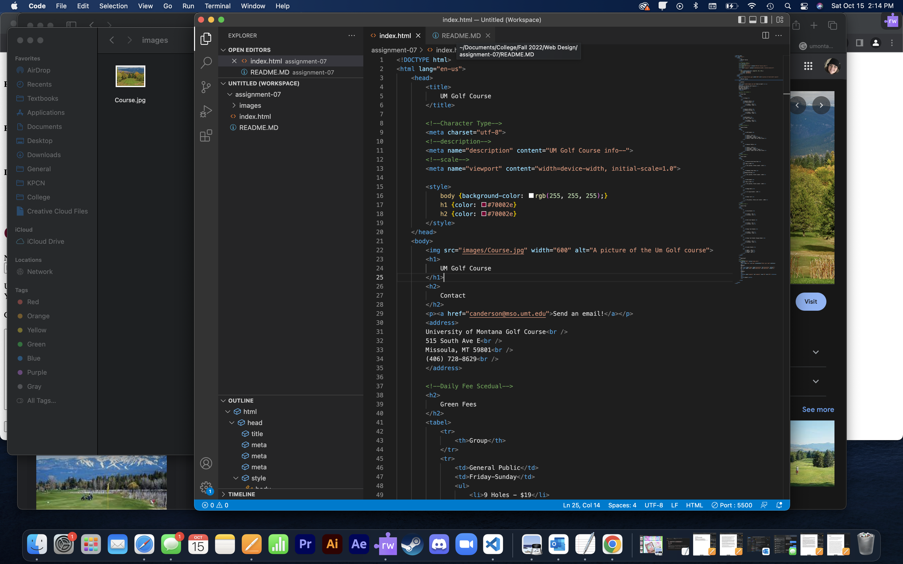

I have come accross lots of companies that i have orderd from who have a textbox that ask you for you email or a note to the creator of the product(Etsy). there are alos times where I see check boxes asking if i would like to recive emails whith updates or if I agree to the terms of service. For the terms of service check box, 99% of the time i cant move on untill i have ched it nomater the company.

 