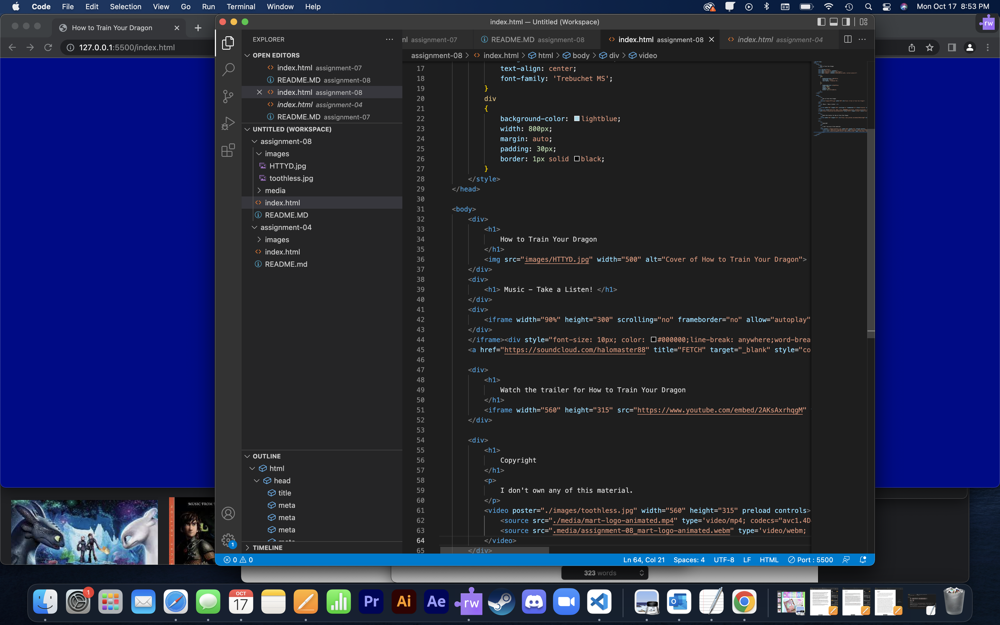

What is an affordance?
An affordance is any possibility that someone might try to interact with anything; like buttons, links, or images on a websight.

What are the advantages and disadvantages of using a third-party service like YouTube or Vimeo to host your videos?
They can reach a larger audiance without having to hand out the URL of a seperate website. It also can show up on peoples recomended because of the algorithms

Optional: What challenges did you face this week with this assignment? How did you overcome them?
I could not get the sound or video border to not get all chuncky even after putting them in their own div.

 