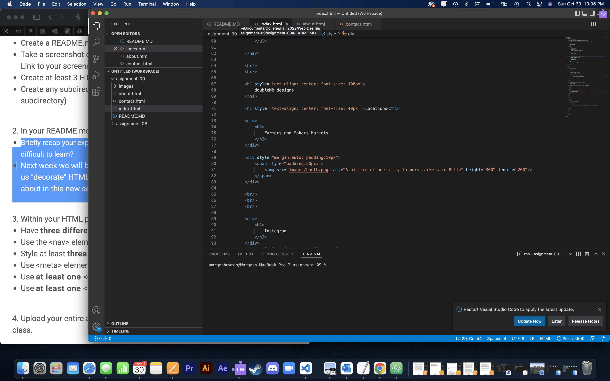

Briefly recap your experience learning HTML. What was old, new, interesting, or difficult to learn?
I rememered a majority of te basics; like how to set up a basic web page, links, and the button. I am very excited to learn how move things around on the web page; like centering the contenet and making colored blocks and stripes around the conent without useing shapes.

Next week we will be diving into CSS and expanding on styling, which helps us "decorate" HTML. Is there anything you're anxious or excited to learn about in this new section?
I am just excited to learn more things to make an effective and pleasing looking websight.

 
