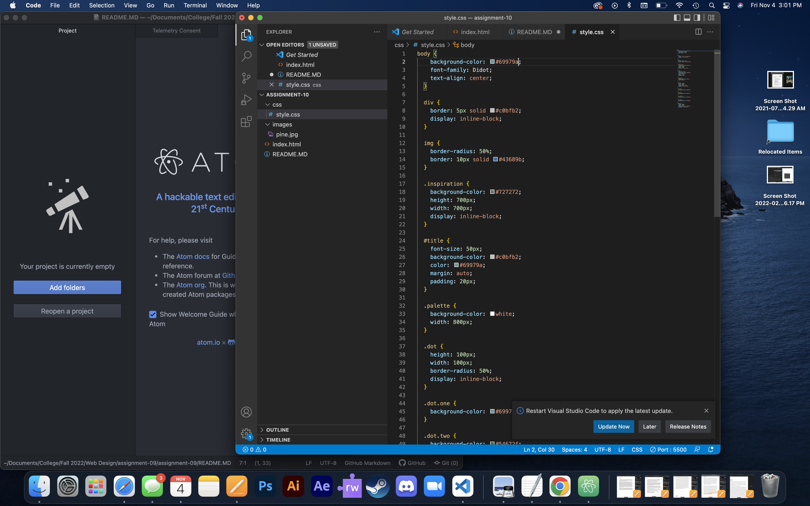

Describe the difference between the universal, element, class, and id selector types. When might you choose one over the other to style content?
ID's only focus on one element, Classes focus on groups of elements, and Universial is for the whole style sheet and will appear if an ID or Class is not called.

Discuss your color palette. How did you choose your colors?
I love more nutral colors and colors that are found in forests. I am a sucker for pine trees and a creeck or river in the same setting.

 