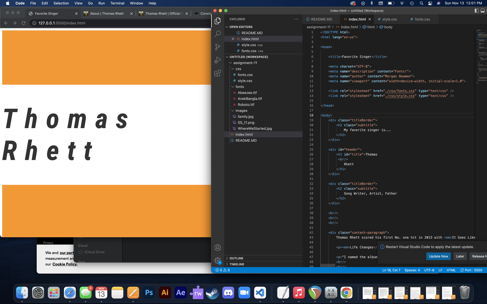

What is typography?
The art of styleizing text

What is the importance of having fallback fonts or a font stack?
Some fonts might not fit into the format you want so having backup fonts is always a good idea. Also, some people won't always have the font someone chooses downloaded on their computer making the font appear in a weird way to certain viewers.

What is the difference between a system font, web font, and web-safe font?
Web fonts are not on everyones computer and web fonts are on everyones computer. System fonts are downloaded on the computer when the computer is being made in the factory.

 