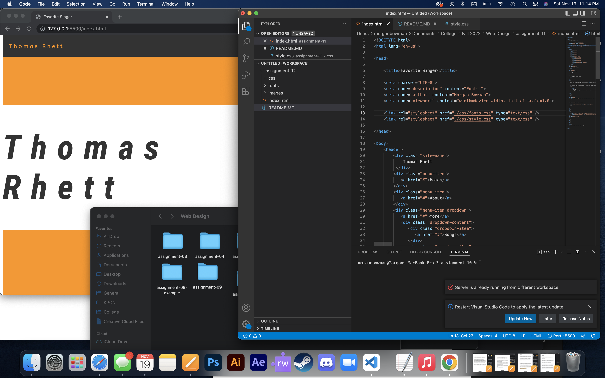

What is the difference between padding, margin, and borders?

Padding is the space given outside of images, margin is the white (or what ever the background color id) space on the sides of the page, and borders are the colored space around almost anything.

 